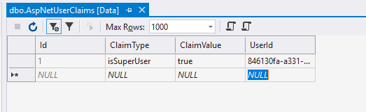

# Pioneer Blog

Active code based used for [Pioneer Code](https://pioneercode).

Current stack...
- ASP.NET Core 2.x
- Entity Framework Core 2.x
- Angular 5.x

Current deployment...
- SQL Database hosted at [WinHost](http://www.winhost.com/a/chadr)
- Site hosted at [DigitalOcean](http://www.digitalocean.com/?refcode=d95b905a1279)
  - Under Ubuntu and faced by NGINX

## Admin 
Full-featured admin portal.


## Setup

### Repository
Clone the repository to your local environment.

```bash
git clone https://github.com/PioneerCode/pioneer-blog.git
```

### Configuration
All configuration is derived from `appsettings.json`. That being said, it is recommended you create an `appsettings.development.json`  and `appsettings.production.json` file to override these settings.

### Database

- Update the connection string inside of `Pioneer.Blog\appsettings.json` & `Pioneer.DAL\appsettings.json`.
- Open a command prompt at `Pioneer.Blog` and run the following

```bash
dotnet ef database update
```

At this point, a database and all corresponding tables should have been created in your database instance. 

### Front-end

Install [node](https://nodejs.org/en/) on your local environment and run the following.

gulp
```bash
npm rm --global gulp
npm install gulp-cli -g
```

typings
```bash
npm install typings -g
```

Navigate to the `Pioneer.Blog` directory from your command prompt and run....
- `npm install`
- `npm rebuild node-sass --force`
- `gulp pubilc`
- `gulp admin`

### Run

That is it! You now should be able to build and launch the project from your IDE of choosing. 

### Registering A Super Account

- Launch your application in debug mode.
- Navigate to /account/register.
	- Register a new account.
- Open up your AspNetUserClaims and AspNetUsers table.
- Add a new claim of the type **isSuperUser**
	- Supply your newly registered UserId as the FK.



You can now use this account to perform all administrative tasks. 

## What Is Next

- If your curious what is coming down the pipe, I track features as [isuses](https://github.com/PioneerCode/pioneer-blog/issues).
- If there is interest, I am willing to entertain the idea of abstracting the vast majority of code away from the Pioneer Blog domain so that it can't be reused without to much refactoring.  

## [CHANGELOG](CHANGELOG.md)
